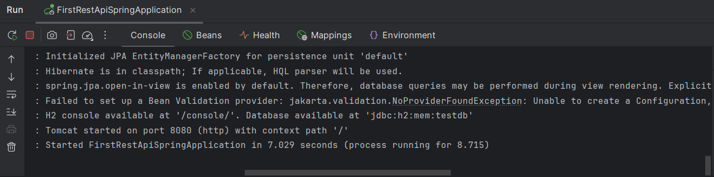
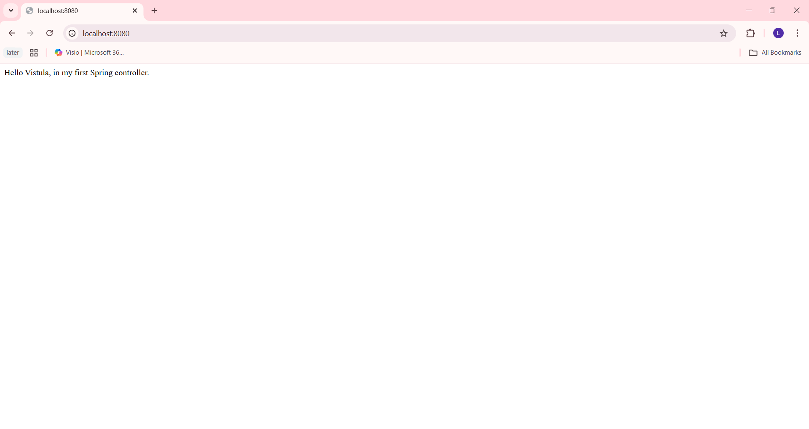
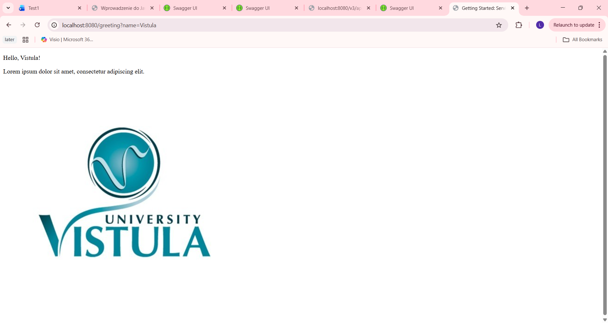

**Spring Boot MVC Application**

**Description**

Task 1 is a simple Spring Boot application that demonstrates:

* creating a Spring project from scratch,
* using a controller
* handling HTTP GET requests
* returning text and HTML views.

**Technologies Used**

* Java
* Spring Boot
* Spring Web
* Maven
* Thymeleaf

**How It Works**

* The application runs on localhost:8080
* A controller handles browser requests
* One endpoint returns a simple text response
* Another endpoint returns an HTML page using Thymeleaf

**How to Run**

Open the project in IntelliJ
Run the main Spring Boot class
Open your browser and go to:
http://localhost:8080

**Screenshots – Task 1**

Application started successfully (console output): 

GET request result in browser: 

HTML / Thymeleaf view rendered: 